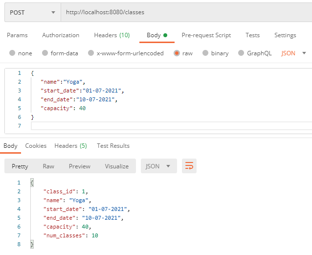
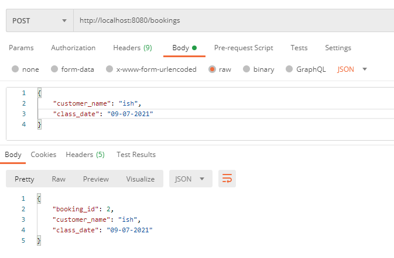

# Fitness classes and its bookings' creation

# Project description:

1. As a studio owner i want to create classes for my studio so that my members can attend classes.
    * Few bare minimum details we need to create classes are - class name, start_date, end_date, capacity. For now,
      assume that there will be only one class per given day. Ex: If a class by name pilates starts on 1st Dec and ends
      on 20th Dec, with capacity 10, that means Pilates has 20 classes and for each class the maximum capacity of
      attendance is 10.


2. As a member of a studio, I can book for a class, so that I can attend a class.
    * Few bare minimum details we need for reserving a class are - name(name of the member who is booking the class),
      date(date for which the member want to book a class)

# How to run this project

## Pre-requisities

#### Java SE Development Kit 8 (1.8.0) or newer

Run this command in your terminal to see what version you have setup

```
javac -version
```

#### Maven 3.0 or newer

Run this command in your terminal to see what version you have setup

```
mvn -version
```

## Project Download

You can either

* Download the .zip file and extract it
* Clone the project using git

## Build the project

* After you have unzipped / cloned the project, using your terminal navigate to its root folder (customer-invite folder)
* Now run this command:  `mvn clean install`
* This will use Maven to download the required dependencies, and build an executable jar file in the newly created "
  target" folder

## Run the project

You can now execute the project by navigating inside the target folder and running this command

`mvn spring-boot:run`

Access the url: http://localhost:8080/swagger-ui.html#/ to see the APIs and to try it out.

### <u>Classes API:</u>

POST:
http://localhost:8080/classes

Data:   {"name":"Yoga",
"start_date":"01-07-2021",
"end_date":"10-07-2021",
"capacity": 40 }

Sample Output data:

```
{
    "class_id": 1,
    "name": "Yoga",
    "start_date": "01-07-2021",
    "end_date": "10-07-2021",
    "capacity": 40,
    "num_classes": 10
}

```

### <u>Bookings API:</u>

POST:
http://localhost:8080/bookings

Data:   {
"customer_name": "san",
"class_date": "09-07-2021"
}

Sample Output data:

```
{
    "booking_id": 3,
    "customer_name": "san",
    "class_date": "09-07-2021"
}

```


# What can be improved here:

* Add Front end to book classes and its bookings.
* Add User input for the selecting te classes whle booking.
* Add Tests for RESTClient calls
* Add Authorization and authentication for restapis.
* Add validation and error responses

## Author:

Sakuntala Murugesan dhya.san@gmail.com
